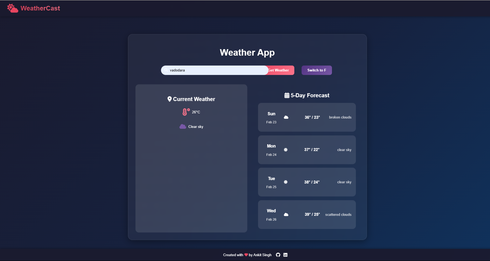

# WeatherCast - Weather Forecast Application 🌤️

A modern, responsive weather application that provides real-time weather information and 5-day forecasts with a beautiful dark theme and glass-morphism design.

## Features ✨

- **Real-time Weather Data** with current conditions
- **5-Day Weather Forecast**
- **Temperature Units** (Celsius/Fahrenheit) toggle
- **Responsive Design** for all devices
- **Modern UI** with glass-morphism effects
- **Dynamic Weather Icons**
- **Loading Animations**
- **Error Handling**

## Tech Stack 🛠️

- HTML5
- CSS3 (with modern animations)
- JavaScript (ES6+)
- OpenWeather API
- Font Awesome
- Google Fonts

## Live Demo 🚀

[View Live Demo](https://your-username.github.io/weathercast)

## Setup & Installation 📦

1. **Clone the repository**
  bash
  git clone https://github.com/your-username/weathercast.git
  cd weathercast

2. **API Setup**
- Get your API key from [OpenWeather](https://openweathermap.org/api)
- Create `config.js` in project root:
        javascript
        const config = {
        apiKey: 'YOUR_API_KEY'
        };

3. **Run the application**
- Open `index.html` in your browser
- Or use a local server of your choice

## How to Use 💻

1. Enter city name in the search box
2. Click "Get Weather" or press Enter
3. View current weather and forecast
4. Toggle temperature units as needed

## Contributing 🤝

Contributions are welcome! Feel free to:
1. Fork the repository
2. Create your feature branch
3. Commit your changes
4. Push to the branch
5. Open a Pull Request

## Author 👨‍💻

**Ankit Singh**
- GitHub: [@Ankit101104](https://github.com/Ankit101104)
- LinkedIn: [Ankit Singh](https://linkedin.com/in/ankit101104)

## License 📄

This project is licensed under the MIT License.

---

⭐ Star this repo if you find it helpful!

